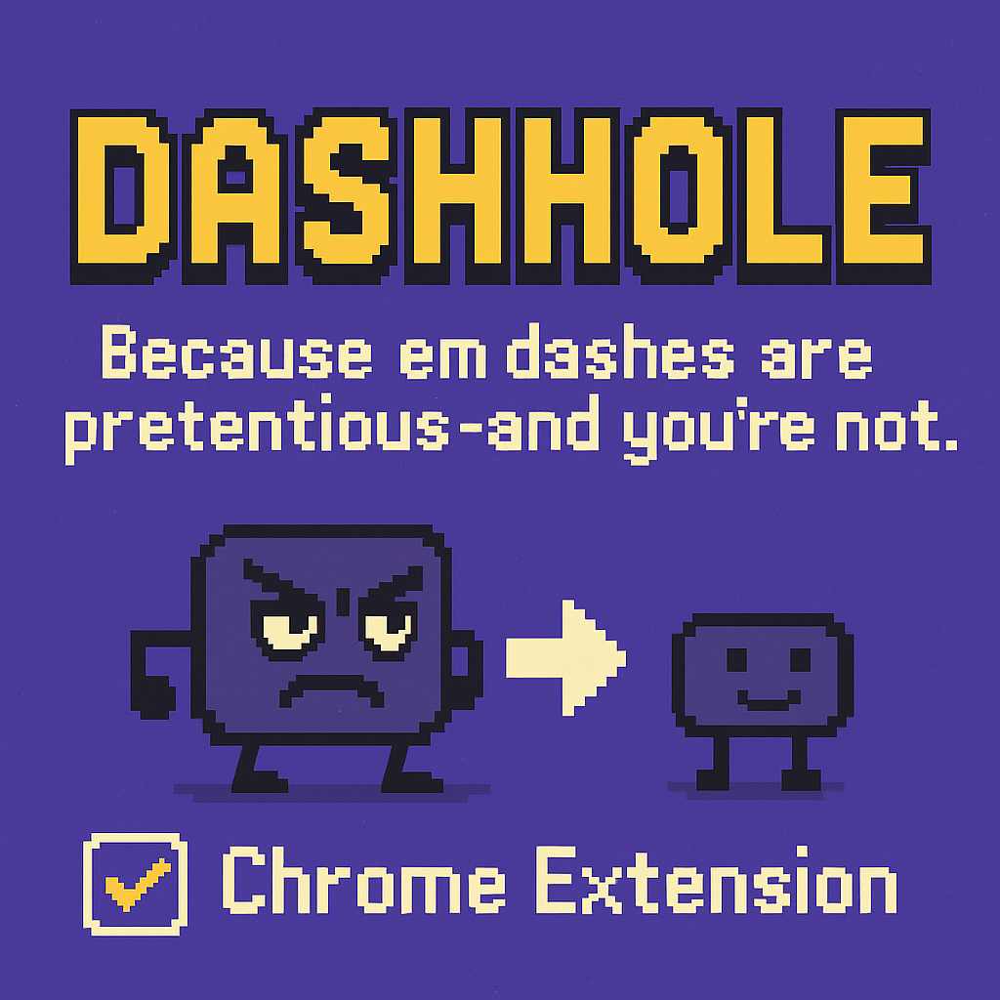
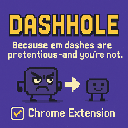

<<<<<<< HEAD
# 💥 Dashhole

### Because em dashes are pretentious - and you're not.

**Dashhole** is a Chrome extension that hunts down every em dash (—) on ChatGPT and replaces it with a good ol' humble hyphen (-).  
No drama. No flair. Just straight-shootin’ punctuation.

> ✂️ _"One small dash for man, one giant leap for clarity."_ — You, after installing this

---

## 📸 Promo

---

## 😤 Why?

Because sometimes you're just tryna read a message and it’s like—

BOOM. Long obnoxious punctuation mark.

So this extension steps in, politely replaces all those em dashes, and walks away like a pixelated hero.

---

## 🔥 Features

- ☑️ Replaces all em dashes (—) with hyphens (-)
- ☑️ Only runs on [chatgpt.com](https://chatgpt.com)
- ☑️ Includes an on/off toggle so you can stop being a Dashhole anytime
- ☑️ Absolutely zero tracking or data usage
- ☑️ Hosted on GitHub because we’re not paying Google $5 for this

---

## 🛠 How to Install (Unpacked)

1. Click the green **Code** button above → **Download ZIP**
2. Extract the ZIP
3. Go to `chrome://extensions/` in your browser
4. Enable **Developer Mode** (top right)
5. Click **Load unpacked** and select the extracted folder
6. Done! Click the 🧩 icon to toggle Dashhole on/off

---

## 😈 Extension Icon

---

## 🧼 Disclaimer

No em dashes were harmed in the making of this extension.  
(Just... gently removed. For your benefit.)

---

## 📃 License

MIT - because we’re Dashholes, not monsters.
=======
# dashhole
Chrome extension that replaces em dashes with hyphens on ChatGPT. That's it.
>>>>>>> 1cb37e4b8eda6a7459e0fe84f60c65ace1dee530
